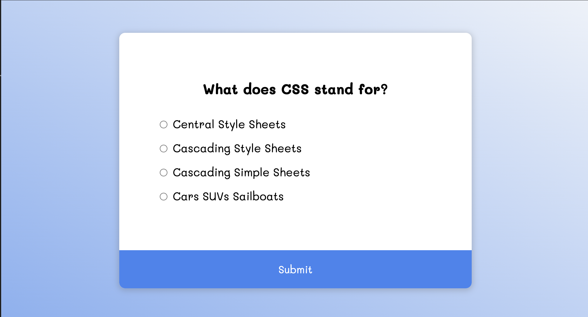

# Quiz App



A dynamic and responsive Quiz App built with HTML, CSS, and JavaScript. This project allows users to test their knowledge with a series of multiple-choice questions. Featuring interactive feedback, score tracking, and answer review, the app delivers an engaging user experience. Perfect for learning or entertainment purposes!

## Key Features
- **Multiple-Choice Questions**: Includes a set of pre-defined questions with four answer options each.
- **Score Tracking**: Displays the user’s score at the end of the quiz.
- **Answer Review**: Allows users to review the correct answers after completing the quiz.
- **Restart Option**: Easily restart the quiz to improve your score.
- **Responsive Design**: Works seamlessly across devices with an intuitive interface.

## Technologies Used
- **Frontend**: HTML, CSS (with modern and responsive styling).
- **JavaScript**: Handles question logic, score tracking, and dynamic UI updates.

## How to Run
1. Clone the repository:
   ```bash
   git clone https://github.com/yourusername/Quiz-App.git
   cd Quiz-App
   ```
2. Open `index.html` in your browser to start the quiz.

## Live Demo
Check out the [Live Demo here:](https://chrisroland.github.io/Quiz-App/)

## Future Enhancements
- Add a timer for each question to make the quiz more challenging.
- Support for dynamic question fetching via an API.
- Include a leaderboard to display top scores.
- Add user authentication to save progress and scores.

## Contributions
- Feel free to **open issues** for any bugs or suggestions.
- **Pull requests** are welcome for adding new questions or features.
- This project is **open-sourced**, and I appreciate **constructive feedback** and **collaborations**!

Thank you for exploring this project! ❤️